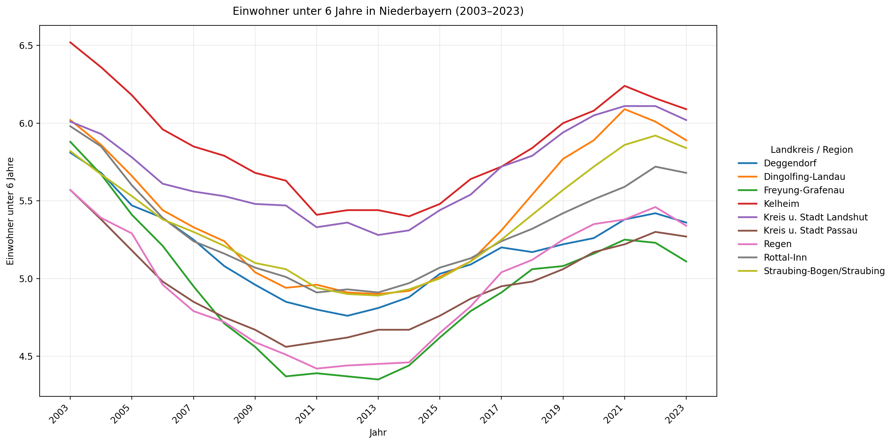
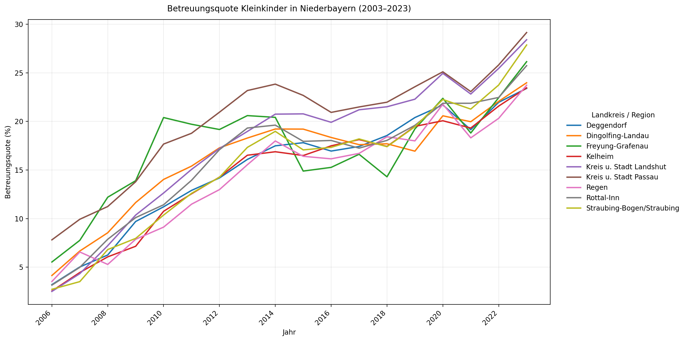
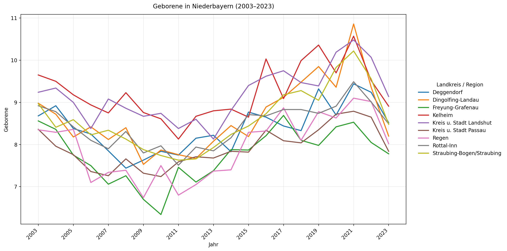
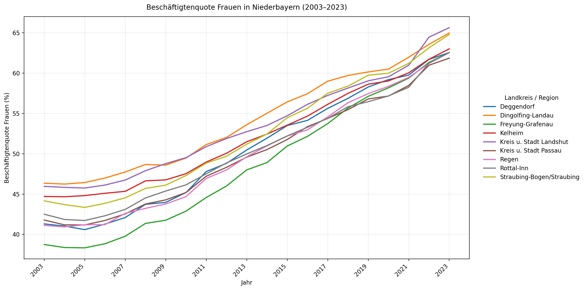

# Familienbetreuung Niederbayern – Datenvisualisierung

## Kurzbeschreibung
Dieses Projekt analysiert den Betreuungsbedarf und die Betreuungssituation für Kinder (0–6 Jahre) in Niederbayern.
Dazu werden Zeitreihen (2003–2023 bzw. 2006–2023) auf Kreisebene ausgewertet und als Diagramme visualisiert.

## Ziel / Forschungsfragen
- Wie haben sich **Betreuungsquote (Kleinkinder)**, **Geburten**, **Anteil/Quote Kinder unter 6** und **Beschäftigtenquote von Frauen** über die Zeit entwickelt?
- Gibt es regionale Unterschiede zwischen den Landkreisen in Niederbayern?
- Besteht ein Zusammenhang zwischen **Betreuungsquote** und **Erwerbstätigkeit von Frauen** (zeitlich / regional)?

## Datenbasis
Die Daten liegen als CSV-Dateien im Ordner `data/` vor (Semikolon-separiert, Dezimaltrennzeichen „,“).
Enthalten sind:
- `Tabelle Kinderbetreuung.csv` (Betreuungsquote Kleinkinder; Jahre 2006–2023)
- `Erwerbstätige Frauen.csv` (Beschäftigtenquote Frauen; Jahre 2003–2023)
- `Geborene.csv` (Geborene; Jahre 2003–2023)
- `kinder_0_6.csv` (Einwohner unter 6 Jahre; Jahre 2003–2023)

## 📊 Datenvisualisierungen

### Einwohner unter 6 Jahre in Niederbayern (2003–2023)


### Betreuungsquote Kleinkinder in Niederbayern (2003–2023)


### Geborene in Niederbayern (2003–2023)


### Beschäftigtenquote Frauen in Niederbayern (2003–2023)


## Ordnerstruktur
- `data/` – Rohdaten (CSV)
- `src/` – Python-Code (Auswertung & Visualisierung)
- `diagrams/` – erzeugte Diagramme (PNG)
- `documentation/` – Methodik, Notizen, Interpretation
- `README.md` – Projektübersicht

## Setup (VS Code)
Empfohlen wird die Nutzung einer virtuellen Umgebung.

```bash
python -m venv .venv

# Windows:
.venv\Scripts\activate

# macOS/Linux:
source .venv/bin/activate

pip install -r requirements.txt